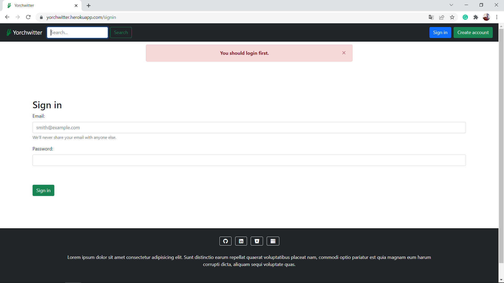
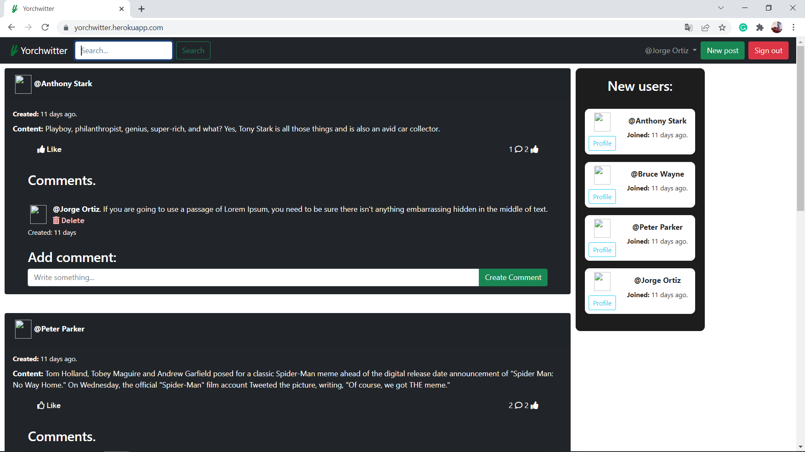

# Yorchwitter.
Twitter clone app.

## Description.
This README would normally document whatever steps are necessary to get the
application up and running.

## SQL commands

* @users_result_fn = where("first_name like ?", "%#{result}%")
* if @users_result_fn.length > 0

* Connection.all
* followers = Connection.where(user_id: 1).count
* following = Connection.where(follower_id: 1).counts

## Softwares and versions.
* Ruby: 3.0.1
* Rails: 7.0.2
* Bootstrap.
* Heroku server: not yet.
* PostgreSQL.
* VS Code.

Have a wonderful day! :smiley:
Greetings :love_you_gesture:

## Author:

* Jorge Ortiz Mata.
* San Luis Potosí S.L.P. México
* ortiz.mata.jorge@gmail.com
* +52 (444) 576 3034.

## Images.

